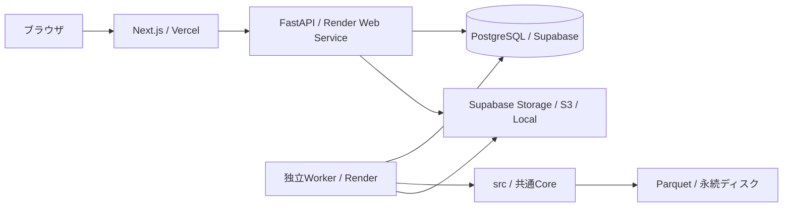

# Web版の起動・運用

Next.js / FastAPI / 独立Worker / PostgreSQL / Parquetで構成する個人用Event Studyアプリ。既存CLIと同じ `src/` を使う。未来の株式数や現在時価総額への代替は行わない。

## 構成



APIのPOSTは設定を検証・固定してジョブIDを202で返すだけ。HTTPリクエスト内で価格取得やバックテストを行わない。DBキューを別プロセスのWorkerが消費する。処理中はハートビートし、Workerが停止すると120秒のリース期限後に再実行する。PostgreSQLは `FOR UPDATE SKIP LOCKED`、ローカルSQLiteは条件付きUPDATEで二重実行を防ぐ。所有権を確認して結果を確定する。

更新は銘柄単位の原子的キャッシュを再利用して再開する。バックテスト再開はその試行の計算を最初から行い、派生指標キャッシュを再利用する。結果ファイルはジョブ・試行ごとに独立して保存する。過去結果を上書きしない。CLIとWorkerは共通の `.run.lock` で価格更新と分析を直列化する。WorkerはV1では1プロセスが推奨。

## ローカル起動

Python 3.10以上（検証3.12）、Node.js 20.9以上（22以上を推奨）、npmが必要。SQLiteとLocal Storageで全機能を実行できる。既存CLIの `data/` をそのまま使う。

```bash
cd volume_bottom_backtest
uv venv .venv
uv pip install --python .venv/bin/python -r backend/requirements.lock.txt
cp .env.example .env
cp frontend/.env.example frontend/.env.local
npm --prefix frontend ci
```

3つのターミナルで起動する。

```bash
# API
.venv/bin/python -m uvicorn backend.app.main:app --host 127.0.0.1 --port 8000
# Worker（既存マスターがありDB品質情報が未登録なら起動時にキャッシュを登録）
.venv/bin/python -m backend.worker.main
# UI
npm --prefix frontend run dev
```

ブラウザで <http://127.0.0.1:3000>。API仕様は <http://127.0.0.1:8000/docs>。明示的な既存キャッシュ登録は `.venv/bin/python -m backend.worker.main --import-cache`。1ジョブだけ処理する場合は `--once`。

既存 `.venv` がある場合は `uv venv` を省略する。環境変数はプロジェクトの `.env`、Frontendは `frontend/.env.local` に設定する。`--import-cache` はYahooへの通信を行わない。初期マスターがない場合はWebのデータ更新ジョブで取得する。

### Docker Compose / PostgreSQL

```bash
docker compose up --build
```

UI3000 / API8000はlocalhostだけに公開する。PostgreSQLの名前付きVolume、共有ワークスペースの `data/`、`results/`、`.run.lock` を利用する。CLIを同時実行する場合も同じ共有ロックを使う。DBの初期パスワードはローカル専用。公開時にはこのCompose構成をそのまま公開しない。

DBのV1スキーマはAPI/Worker起動時にSQLAlchemyで作成する。将来のスキーマ変更には明示的なマイグレーションを追加する。PostgreSQL接続URLは `postgresql+psycopg://...` または通常の `postgresql://...` に対応する。

## 画面と操作

| URL | 内容 |
|---|---|
| `/` / `/dashboard` | 最新データ日、対象・有効キャッシュ数、最近のジョブ、取得状態 |
| `/data` | 価格/株式数/分割の品質、検索、差分更新、失敗分の再試行 |
| `/backtest/new` | 分析・Train/Test期間、下落率、出来高倍率、保有期間、Cooldown、市場、規模、任意の銘柄指定 |
| `/backtests` | 過去バックテスト一覧・ページ切替 |
| `/backtests/{id}` | 進捗、結果、同条件で再実行。データ更新ジョブも同じURLで進捗を表示 |

1. `/data` で株価を更新する。銘柄指定が空欄なら全市場。初回全市場取得は長時間になり得るため、まず少数銘柄を指定して接続を確認できる。
2. `/backtest/new` で条件を選ぶ。初期値は5×5=25条件、保有20/60/120/250営業日、Cooldown20。市場はPrime/Standard/Growth、規模はALL＋6分類。価格キャッシュのある銘柄だけを設定するボタンもある。
3. 実行後は別Workerが処理する。2秒間隔で進捗を表示し、完了・失敗でPollingを停止する。画面を閉じてもジョブは保存される。
4. 結果のタブを使い、期間・保有・市場・規模を切り替える。
5. ヒートマップのセルを選ぶと統計、20ビンのリターン分布、同条件の取引を表示する。件数不足は `*`、欠損は `—`。Profit Factorに損失がなく利益がある場合は `∞`。正のReturnは赤、負は青。
6. 時価総額別・市場別は同じ下落率/出来高/保有期間を比較する。市場と規模を同時に絞り込める。ランキングは全選択保有期間を比較し、平均・中央値・勝率・PF・Expectancy・Signal/取引数・CI・Robustnessでソートできる。
7. 取引はコード/企業名、Signal期間、損益、有効/未成熟/境界除外/不正価格で検索できる。市場・規模・保有・条件フィルタを引き継ぎ、50件ずつ表示する。DuckDBがParquetを検索し、CSVは1,000行ずつストリームする。
8. 取引CSVは現在の絞り込み、パラメータ・市場別・時価総額比較CSVは保存された全設定分をダウンロードする。概要から品質・設定JSON、Train候補・固定候補Test評価も取得できる。

Signal数は銘柄とSignal日で重複除去する。取引数は条件・保有期間ごとのイベント数なので独立標本数とは異なる。平均/中央値/勝率/平均利益/平均損失/最大利益/最大損失/PF/Expectancy/標準偏差/P25/P75/95%銘柄クラスタBootstrap CI/隣接条件Robustnessを共通Coreで算出する。

Trainだけで候補を選び、同条件をTestで評価する。概要の候補表はALL/ALL、CSVには全区分を含む。最低件数（標準100）に達しない場合は候補なし。FULLは境界除外済みTrainとTestの有効取引を結合する参考値で、境界を跨ぐ取引を復活させない。FULL/Testの成績で候補を選び直さない。

Signal株価はRaw Close。Entry/ExitはEntry日の株価単位に揃えた分割・配当調整、費用控除後の価格。調整価格と生価格もCSVに保存する。

## 取得・保存・再開

JPXの現在マスターと無料yfinanceのみを使用する。通常更新は最終確定バーの確認と最新期間、株式数は取得済み期間の先・既知の失敗範囲だけを取得する。過去が不足した場合は不足プレフィックスを補完する。分割・配当等で調整基準が変わった場合だけ整合性のため全履歴を取り直す。最大5回・指数バックオフ。取得失敗時は既存キャッシュを残す。

バックテストはJPX/Yahooへ接続しない。未取得・不正価格は品質に記録して他銘柄を続行する。時価総額は過去の株式数を後方as-ofで結合し、欠損・古すぎる・分割で単位不明の場合は欠損にする。ALLには残し、規模指定では除外する。指標計算に必要な準備データがキャッシュにない場合は、先にデータ更新で分析開始日を指定する。

| 保存先 | 内容 |
|---|---|
| `stocks` / `market_data_metadata` | 現在マスター、価格・株式数の行数/期間/品質/エラー |
| `backtest_jobs` / `backtest_configs` | 状態・進捗・リース、変更不能の実行時設定 |
| `backtest_results` | 期間×規模×市場×条件×保有期間の集計と索引 |
| `backtest_trades` | ジョブの取引Parquet場所・総行数 |
| `system_state` | 品質スナップショット、復元用の市場データObjectキー |
| `data/market`, `data/shares`, `data/benchmark` | 共通Parquetキャッシュ |
| `data/web/runs/{job}/{attempt}` | 試行単位の計算・レポート出力 |
| Local / Supabase / S3 | 確定結果の不変Objectキー、市場キャッシュの変更分バックアップ |

Workerは永続ディスクをPrimaryにし、更新完了時に価格・株式数・マスター・マニフェスト・失敗履歴の変更分をObject Storageへバックアップする。成功した銘柄は更新中からディスクへ保存する。再起動時・バックテスト開始時に欠落ローカルファイルをDBのObjectキーから復元する。APIは取引・CSVをObject Storageから取得してローカルへキャッシュするため、APIとWorkerのディスク共有は不要。Local Storageは同一マシン/共有Volume専用。

保存は追記型。古い試行や市場スナップショットの自動GC・DBマイグレーション・複数ユーザーの利用制限はV1では未実装。全市場ではディスク容量・Workerメモリを監視し、キャッシュやObjectを削除する際はDBが参照する確定結果を保護する。APIのArtifactキャッシュも永続運用では容量管理が必要。

## 環境変数

| 変数 | 用途 |
|---|---|
| `WEB_ENV` | `development` / `production`。公開時はproduction |
| `DATABASE_URL` | PostgreSQL接続（ローカル未指定は `data/web.sqlite3`） |
| `WEB_DATA_ROOT` | Worker/CLI共有のルート。配下に `data`・`results`・`.run.lock` |
| `BACKTEST_CONFIG` | CoreのYAML設定。標準はリポジトリ `config.yaml` |
| `API_TOKEN` | APIのBearer認証。Next側にも同じ値をサーバー環境変数で設定 |
| `STORAGE_BACKEND` | `local` / `supabase` / `s3` |
| `STORAGE_DIR` | Local Object保存先 |
| `ARTIFACT_CACHE_DIR` | APIのObject取得キャッシュ |
| `SUPABASE_URL`, `SUPABASE_SERVICE_ROLE_KEY` | Supabase Storageのサーバー側認証 |
| `STORAGE_BUCKET` | Private bucket名（標準 `backtests`） |
| `S3_ENDPOINT_URL`, `AWS_REGION` | S3互換接続先・リージョン |
| `AWS_ACCESS_KEY_ID`, `AWS_SECRET_ACCESS_KEY` | S3用認証（IAM RoleもSDK標準で利用可） |
| `BACKEND_URL` | NextサーバーからのAPI接続先 |
| `WEB_ACCESS_PASSWORD` | 公開FrontendのBasic認証パスワード。ユーザー名は任意 |

`API_TOKEN`、DB文字列、Storageサービスキーは `NEXT_PUBLIC_*` に入れない。APIへ送る秘密値はNextのRoute Handlerで付与する。Frontendから直接DB/Storageへ接続しない。公開モードではAPIがPostgreSQL・トークン・共通Object Storageを要求し、Frontendはパスワード未設定時にアクセスを拒否する。個人V1の公開保護はHTTPS＋Basic認証。複数ユーザー向けSupabase Auth・権限制御は後から追加する。

## Vercel / Render / Supabaseへの配置

実アカウント・認証情報・サービス作成が必要。リポジトリだけで実デプロイ済みにはならない。

1. SupabaseにPostgreSQLとPrivate Storage bucket `backtests` を作成。Parquetサイズに応じてbucketのアップロード上限を確認する。DB接続はSSLを使用する。接続数はAPIとWorkerのPoolを考慮し、接続先/Poolerを設定する。
2. RenderにこのGitHubリポジトリを接続し、`render.yaml` でAPI Web ServiceとBackground Workerを作成。両方に**同じ** `DATABASE_URL`、`API_TOKEN`、`SUPABASE_URL`、`SUPABASE_SERVICE_ROLE_KEY`、`STORAGE_BUCKET` を設定。Workerの `/var/backtest` は永続ディスク、20GBは初期例なので全市場データ・結果量に合わせて拡張する。
3. VercelのRoot Directoryを `frontend` にし、`frontend/vercel.json` のNext.js設定で配置。`BACKEND_URL=https://...onrender.com`、`API_TOKEN`、`WEB_ENV=production`、`WEB_ACCESS_PASSWORD` をサーバー環境変数に設定。
4. `https://.../health`、保護された画面、少数銘柄の更新、バックテスト、CSV、Worker再起動後の過去結果閲覧を確認する。
5. 全市場取得を実行する場合はWorkerのリソース・無料Yahoo APIの失敗率・ディスクを監視する。

RenderのAPIとWorkerは別ディスクなので、StorageはSupabase/S3を使う。秘密値をRender BlueprintやVercel JSONへ埋め込まない。本番接続先がないローカル検証では配置ファイルと手順のみを完成させる。

公式資料: [Next.js installation](https://nextjs.org/docs/app/getting-started/installation)、[Render Blueprint](https://render.com/docs/blueprint-spec)、[Render persistent disks](https://render.com/docs/disks)、[Supabase Storage](https://supabase.com/docs/guides/storage)。

## 検証

```bash
.venv/bin/python -m pytest -q
npm --prefix frontend run test
npm --prefix frontend run typecheck
npm --prefix frontend run build
# UI/API/Workerを起動してから実接続のE2E（既存の5銘柄キャッシュ使用）
npm --prefix frontend run test:e2e
# キャッシュの銘柄を変更する場合
E2E_TICKERS=7203,6758 npm --prefix frontend run test:e2e
```

E2Eは市場データの大量取得を行わず、バックテスト2回（新規・再実行）の履歴を作る。合成データのWorker/APIテストはネットワーク呼び出しを禁止している。PostgreSQL実接続テストは `TEST_DATABASE_URL` に**専用の使い捨てDB**を設定すると実行する（既存データは使わない）。

実測の条件・件数・取得成功率・時価総額カバー率・未検証項目は `WEB_VERIFICATION.md` を参照。現在キャッシュが少数銘柄の場合、マスター全3,700銘柄の取得済みと表示しない。価格未取得数と、実際の取得エラーを分けて表示する。

## 制約・拡張

Survivorship Bias、JPX月末スナップショットの現在市場区分、Yahooの株式数日時の公表時刻不明、分割/repair誤り、無料APIの欠損・レート制限がある。約定不能・流動性・売買単位・税金は再現しない。Event Studyであり資金配分を仮定したCAGR/Sharpe/Portfolio最大DDを算出しない。条件と保有期間に重複・多重比較がある。

将来はSupabase Auth、利用量管理、Artifact GC、SSE、シグナルスクリーナー、セクター/ローソク足/指標フィルタ、Portfolioシミュレーションを各境界に追加できる。V1に未来スクリーナーや資金管理を混ぜていない。
